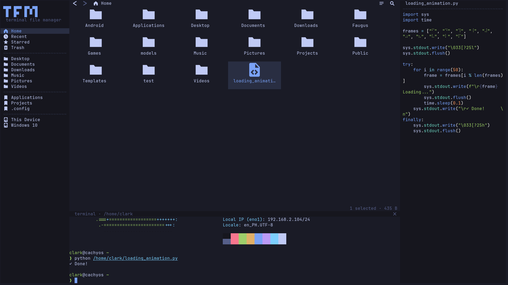

# tfm (terminal file manager)

A modern, mouse-first file manager with Nautilus-inspired places sidebar, grid view, drag & drop, image thumbnails


> [!WARNING]
> Vibecoded experimental software — expect rough edges. Don't test on files you can't afford to lose.

> [!IMPORTANT]
> This is still a terminal UI running inside your terminal, expect some visual/behavioral anomalies.



## Features

- **Mouse-first**: click, rubber-band select, context menus, inline rename
- **Drag & drop**: move between folders (`ctrl+drag`), drag out to other apps, drop in from outside — cross-app DnD is kitty-only (OSC 72), in-app drag works everywhere
- **Desktop integration**: GTK bookmarks, recent files (`recently-used.xbel`), XDG trash with restore, system clipboard bridge
- **Embedded terminal**: right-click empty space → **Open Terminal Here** runs `$SHELL` in a pane at the current folder; keys hand off to tfm when you click the grid
- **Previews**: kitty image thumbnails, tree-sitter syntax highlighting, folder stats
- **Themes**: 30+ bundled presets (Tokyo Night, Catppuccin, Dracula, Gruvbox, Nord, Rose Pine, Solarized, …) with live switching, fully configurable via `config.toml`

## Requirements

- Linux
- A terminal with the [kitty graphics protocol](https://sw.kovidgoyal.net/kitty/graphics-protocol.html) (kitty, ghostty) — falls back to Nerd Font glyphs elsewhere
- `rsvg-convert` (icon rasterization), `wl-paste`/`xclip` (clipboard bridge)

## Install

```bash
curl -fsSL https://raw.githubusercontent.com/clarkarch/tfm-tui/master/install.sh | bash
```

Installs to `~/.local/bin` as `tfm` (and `terminal-file-manager`). Prebuilt binaries for linux x86_64/aarch64 are on [Releases](https://github.com/clarkarch/tfm-tui/releases).

From source:

```bash
bun install
bun run compile && cp dist/tfm ~/.local/bin/
```

Dev: `bun dev`. Launch anywhere with `tfm ~/some/path`.

## Keys

| Key | Action |
|---|---|
| type anywhere | live search · `enter` opens first match · `esc` cancels |
| `enter` / `f2` | open / rename |
| `backspace` | parent directory |
| `ctrl+z` / `ctrl+a` | undo / select all |
| `ctrl+h` | toggle hidden files |
| `delete` | trash (`delete` again in trash: permanent) |
| `ctrl+click` / `shift+click` | toggle / range select |
| plain drag / `ctrl+drag` | drag out of terminal / move inside tfm |
| right-click | context menu |

## Config

`~/.config/tfm/config.toml` — see [`config.example.toml`](config.example.toml). Themes, tile size, session restore, glyph-only icon mode.

## Limitations

- Linux only; no macOS/Windows support
- Image thumbnails need a kitty-graphics-protocol terminal (kitty, ghostty); others fall back to Nerd Font glyphs
- tmux hides rasters unless `allow-passthrough` is on; icons render but won't display images
- Cross-device moves are copy+delete (no atomic rename across filesystems)
- Drag & drop to/from other apps is kitty-only (OSC 72): ghostty does image thumbnails and in-app drag (`ctrl+drag`), but cross-app drag **won't** work there
- Single pane — no tabs or split view yet

## License

[MIT](LICENSE)
