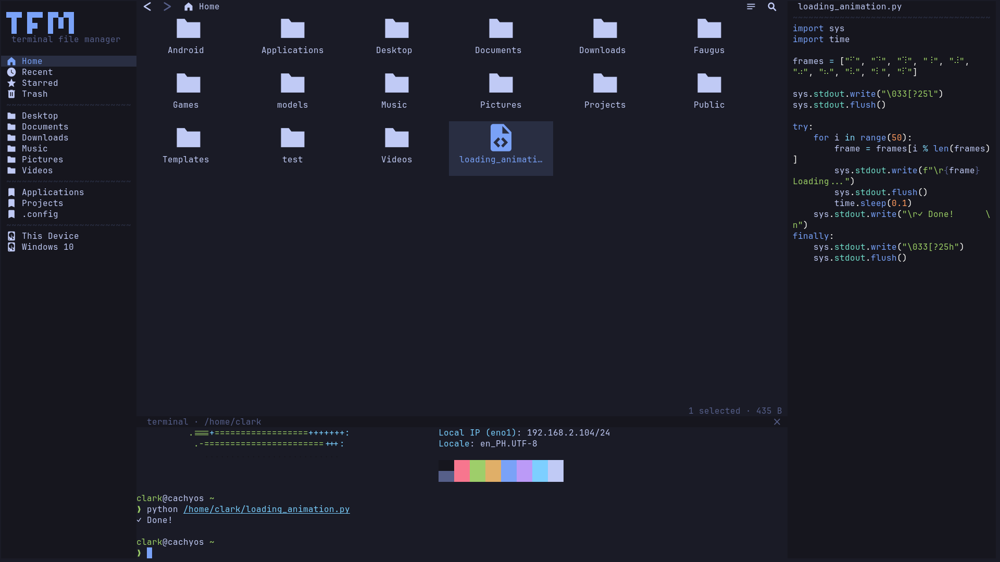

<p align="center"></p>
<h1 align="center">tfm</h1>
<p align="center">terminal file manager</p>

A modern, mouse-first file manager with places sidebar, grid view, drag & drop, image thumbnails and more, right inside your terminal.

 [](https://clarkarch.github.io/tfm-tui/)




## Features

- Mouse: click, rubber-band select, right-click menus, drag and drop.
- Browse files in grid or list view.
- Sidebar with places, bookmarks, drives, trash, recent, starred.
- Search as you type, including inside subfolders.
- Sort by name, size, date.
- Copy, move, paste, duplicate, rename.
- Bulk rename multiple files at once.
- New file / new folder inline.
- Drag and drop between panes and from other apps.
- Trash, restore, delete forever, empty trash.
- Undo / redo file operations.
- Preview text, code, images, videos, folders.
- Open files + Open With app picker.
- Properties dialog with permissions editing.
- Tabs + dual pane.
- Connect to network servers.
- Extract and compress archives.
- Embedded terminal.
- Clipboard copy/paste with other apps.
- Open privileged files with sudo prompt.
- Customizable themes, settings GUI, keybinds.
- Plugin support with hot reload.
- …and many more.

## Requirements

- Linux.
- Terminal with the [kitty graphics protocol](https://sw.kovidgoyal.net/kitty/graphics-protocol.html) (kitty, ghostty, WezTerm, Konsole etc).
- Everything below is optional.
  - `xdg-open` (opening files)
  - `magick` (extra photo thumbnails)
  - `gio` (starred files and servers)
  - `udisksctl` (USB drives)
  - `wl-clipboard` / `xclip` (copy and paste with other apps)
  - `tar` / `unzip` / `zip` / `7z` (zip files and archives)

## Install

```bash
curl -fsSL https://raw.githubusercontent.com/clarkarch/tfm-tui/main/install.sh | bash
```

### dev build

Latest dev branch, needs git and Bun 1.4 or newer:

```bash
curl -fsSL https://raw.githubusercontent.com/clarkarch/tfm-tui/dev/source.sh | bash
```

Or manually build from source:

```bash
git clone https://github.com/clarkarch/tfm-tui.git
cd tfm-tui
bun install --frozen-lockfile
bun run check && bun test
bun run compile && cp dist/tfm ~/.local/bin/
```

## Keys

- `enter` open · `f2` rename · `backspace`/`alt+up` up · `alt+home` home · `escape` menu · `f1` help
- `ctrl+c/x/v/d` copy/cut/paste/duplicate · `ctrl+z/y` undo/redo
- `tab` switch focused pane · `f5`/`f6` copy/move to the other pane (dual pane)
- `ctrl+t/w` new/close tab · `ctrl+tab` switch tab (per pane)
- `delete` trash · `alt+enter` properties · `ctrl+q` quit
- `ctrl+a` select all · `space` toggle · `shift+arrows` extend selection
- `alt+left/right` history back/forward · `ctrl+shift+n` / `ctrl+alt+n` new folder/file
- `ctrl+shift+d` dual pane · `ctrl+=/-` zoom · `ctrl+r` reload places · `ctrl+alt+r` restart
- `ctrl+h` hidden · `ctrl+l` path bar · `ctrl+g` grid/list · `f3` preview · `ctrl+\``/`f4` terminal · `ctrl+shift+s` connect to server
- `arrows` move · `pageup`/`pagedown` page · `home`/`end` first/last

Everything is remappable: `esc` → Settings → keys.

## Config

`esc` → Settings or:

```bash
TFM_CONFIG=/custom/path/config.toml tfm
```
See [config.example.toml](config.example.toml).

## Plugins

`esc` → Plugins or:

```bash
tfm plugins search
tfm plugins add <url|id>
tfm plugins new my-plugin
```
See [docs/plugins.md](docs/plugins.md).

## Notes

- Thumbnails need the kitty graphics protocol; tmux hides them unless
  `allow-passthrough` is on.
- Cross-app drag & drop is kitty-only.
- Mouse on the Linux console (TTY) needs `gpm` running.
- Icons can show a black box behind open menus or while rubber-band selecting.
- Custom kitty themes can misbehave.

## License

[MIT](LICENSE)
